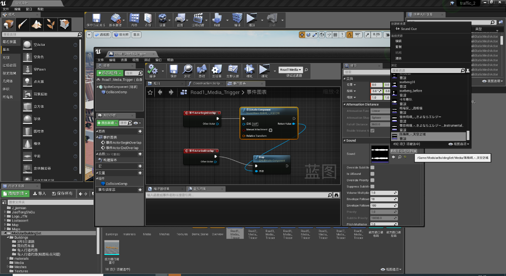
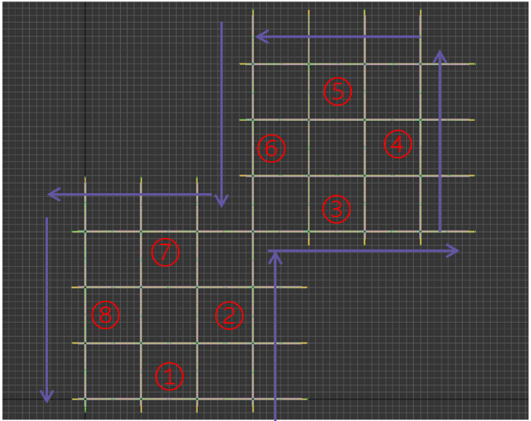
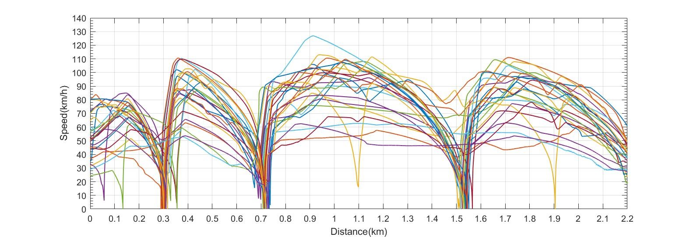
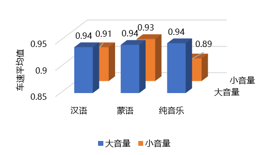
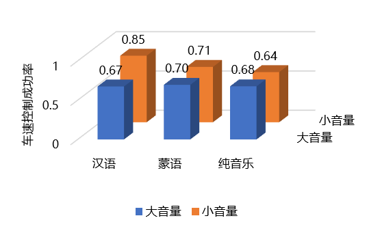
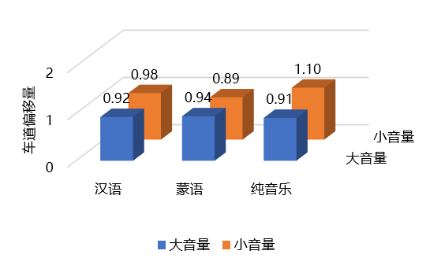
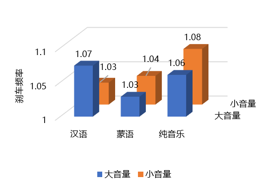
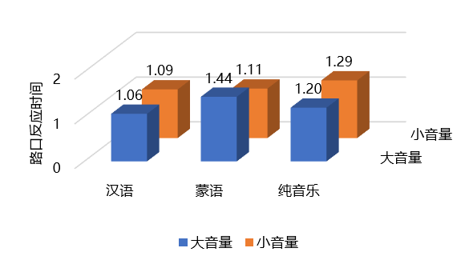
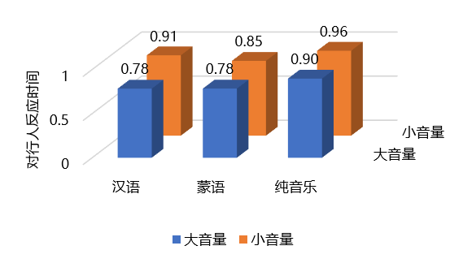

## Abstract

Improper driving behavior is a significant factor contributing to traffic accidents. The influence of listening to music on driving behavior is substantial but often overlooked. In this experiment, a simulation-based experimental approach was employed to investigate the effects of music genre (including instrumental, native language, and foreign language) and volume on driving behavior. Conducted at the "Driving Simulator Laboratory" of Tsinghua University's Institute of Transportation Studies, the experiment utilized the Unreal Engine to construct the experimental scenarios. Prior to and after the experiment, participants were required to complete questionnaires to gather relevant information. During the experiment, participants were instructed to drive along specified routes in two virtual urban environments while listening to different types of music. Additionally, participants were tasked with controlling vehicle speed, lane deviation, and managing sudden situations. Eye-tracking glasses were worn by participants to collect gaze data while driving, and relevant data regarding speed control and emergency situation handling were recorded. Through data analysis, the impact of music on driver focus and reaction capability can be elucidated, providing insights for safe driving practices and potential revisions to regulations by traffic management authorities.

## Literature Review and Background Introduction

Existing experimental studies on the effects of music on driving behavior have mainly focused on the influence of music melodies (such as intensity and rhythm) on driving behavior. Beh and Hirst (1999) investigated the impact of music volume on simple or complex tasks and found that: at lower volumes, music can broaden visual attention, while at higher volumes, it can narrow attention. Yang Meng et al. (2011.5) discovered that compared to slow-paced music, fast-paced music leads to faster driving speeds, shorter average eye blink distances, and shorter vertical search widths. Familiar language compared to unfamiliar language results in slower driving speeds, more errors, longer average gaze times for novice drivers, while experienced drivers' gaze behavior remains unaffected. Cheng Jie et al. (2014.5) studied the effects of volume and rhythm on the cognitive load and driving behavior of various groups of drivers, finding that as music tempo increases, average driving speeds increase, lateral position control worsens, and violation frequency increases; with increasing music volume, violation frequency also increases. Shi Jing et al. (2014.5) found that listening to music while driving, especially rock and heavy metal music, increases the likelihood of improper driving behaviors such as running red lights, speeding, and distraction. Qiu Xin (2015.5) found that under simpler road conditions, higher music volume enhances driver alertness, while under complex road conditions, drivers are more alert when listening to slow-paced music with lower volume. Lai Wuning (2016.3) discovered that light music can reduce driver mental load, while rock music increases driver mental load. Alafat and Wu Chaozhong (2017.1) found that listening to hard rock music has negative effects on driving performance and physiology, while listening to natural sounds can improve driver driving ability. Li Shu (2018.3) found that listening to in-car music while driving leads to decreased vehicle speed, lane-keeping ability, steering wheel operation ability, and event detection ability, thereby increasing driving risk.

In addition to the aforementioned studies, some research has found that the impact of music on driving behavior is not significant. Ayca Berfu Ünal, Steg, and Epstude (2012.1) found that whether or not to listen to music has little effect on drivers' driving behavior, as drivers tend to increase mental effort as a cognitive compensation strategy when listening to music to handle task demands.

Some studies provide theoretical explanations for the impact of music on driving behavior. The arousal theory suggests that music helps drivers maintain optimal levels of emotional arousal to sustain driving alertness (Brown, 1965); the "distraction hypothesis" posits that music can also distract drivers, increasing the cognitive load and jeopardizing road safety (Turner, Fernandez, & Nelson, 1996). While "arousal" and "distraction" emphasize the unidirectional effects of music, the dynamic theory integrates both viewpoints, suggesting that the effects of music on drivers are arousal or distraction-dependent, depending on factors such as music attributes, driving context demands, and individual differences in drivers' characteristics (Oron-Gilad, Ronen, & Shinar, 2008). The latest Compensatory Control Theory proposes that drivers adjust their driving behavior to compensate for distractions or secondary task interference, which addresses the oversight of driver agency in the dynamic theory (Young, Regan, & Hammer, 2007).

Most of the experimental methods in the aforementioned studies involve simulated driving. However, simulated driving differs significantly from driving in real road environments, and the reliability of its results is often lower than experiments conducted on actual roads. Therefore, the author's research utilizes the cutting-edge rendering capabilities of Unreal Engine 4 to build scenes and conduct driving simulation experiments.

## Method

### 1 Participants
A total of 38 participants were recruited from the university campus, consisting of undergraduate or graduate students who possessed a valid driver's license. All participants had an average eye-tracking data sampling rate higher than 95%, which was considered for statistical analysis. All participants were university students who had obtained their driver's license within the past five years and had driven less than 10,000 km, categorizing them as novice drivers. The average age of participants was 21 years old, with an average driving experience of 1.5 years. All participants had normal hearing, vision, or corrected vision, and were unfamiliar with the unfamiliar language (Mongolian) set in the experiment.
### 2 Experimental Tools
#### 2.1 Eye Tracker
The experiment utilized an eye tracker to record participants' eye movement trajectories, with a sampling rate of 120Hz and dual-eye tracking capabilities. It could capture data such as eye blink frequency, pupil diameter, gaze point position, and gaze duration, which were used by the experimenter to assess participants' focus and reaction abilities during driving.
#### 2.2 Experimental Materials
##### 2.2.1 Road Video Scenes
Interactive video images of simulated urban road conditions were continuously played for participants on four projection screens. Each pair of adjacent screens simulated forward, lateral, and rearward driving perspectives, providing a 360° view of road conditions without blind spots. The interactive video images were derived from the constructed virtual urban road scenes realized through the Unreal Engine 4.

##### 2.2.2 Music Materials
High-quality music was downloaded from two well-known music websites and categorized into three types based on language: instrumental music (without lyrics), Chinese music (native language), and Mongolian music (unfamiliar language). The low volume level was set at 50dB, similar to the built-in engine noise, while the high volume level was set at 70dB, measured with a decibel meter. Apart from the six types of music consisting of two volume levels and three languages, a blank segment without music was included as a control. With these seven language and volume music variations as the only variable, the experiment aimed to investigate their effects on participants.

Figure 1. Music Implementation

### 3 Experimental Design
In the virtual road scenes, eight straight road segments were set up (one for familiarization practice and seven for music experiment segments). Each road segment was 2.4km long, divided into three sections of 800m each, with intersections containing traffic lights at the boundaries. Except for the first road segment where participants started, the remaining seven road segments each had two driving events: vehicles running red lights laterally and pedestrians suddenly crossing the road. Pre-tests indicated that drivers did not experience significant discomfort during simulated driving experiments, but they required a short learning period to familiarize themselves with the operation. Therefore, the first road segment was provided as a conflict-free trial segment.

Figure 2. Experiment Road Segments

### 4 Experimental Procedure
After recruiting participants, they filled out pre-experiment questionnaires to collect driving-related information, such as driving duration and distance. Participants were then informed of the experimental schedule, and they were instructed to proceed to the driving simulation laboratory at the designated time. They were briefed on the experimental tasks and required to wear eye-tracking glasses (fitted with appropriate plano or myopic lenses according to participants' visual acuity) and Bluetooth earphones. Subsequently, eye tracker calibration was conducted. Participants were briefed on the presence of sudden traffic conflicts during testing, and their task was to drive on the correct simulated roads according to the screen instructions. In the event of a traffic conflict, they were instructed to operate the driving simulator appropriately to avoid traffic accidents. The experiment was conducted in a controlled environment free from external disturbances, with constant lighting and indoor quietness, lasting approximately 40 minutes. After the experiment, participants were asked to fill out post-experiment questionnaires.

### 5 Data Collection
The cardata software was used to record relevant data such as steering wheel, brake, and accelerator inputs from the simulator, as well as vehicle speed and position in the experimental scenes (20Hz). Simultaneously, Curestudio software was used to collect eye-tracking data (120Hz).

## Data Processing
### 1 Reasonableness Check
The shape of the speed curve is consistent, and the design of sudden events is effective, achieving the intended purpose satisfactorily.

Figure 3. Speed of Participants on Experimental Road Segment 5

### 2 Data Analysis
To clearly demonstrate the extent of the music's effects, we performed the following operations on all indicators: we calculated the average values of over thirty valid data points for each type of music as the experimental group data, and then normalized the data of the six experimental groups (six music conditions) by dividing them by the control group data.

#### 2.1 Effect of Music on Speed
The relationship between the average speed of each participant on each segment and the music played on the corresponding road segment is presented in a three-dimensional bar graph (Figure 4). It was observed that music led to a decrease in driving speed, with low-volume music having a more significant effect, while the volume of unfamiliar language songs had a smaller impact.

Figure 4. Relationship between Speed and Music

#### 2.2 Effect of Music on Speed Control
The relationship between the proportion of successfully controlled speeds by each participant on each segment and the music played on the corresponding road segment is shown in a three-dimensional bar graph (Figure 5). It was found that music led to a decrease in speed control ability, with high-volume music having a more pronounced effect, while the impact of low-volume music with native language lyrics was minimal.

Figure 5. Relationship between Speed Control Success Rate and Music

#### 2.3 Effect of Music on Lane Deviation
Observing the impact of music on lane deviation (Figure 6), it can be seen that music enhanced lateral control ability, with larger sound volumes having a greater impact, except for low-volume instrumental music.

Figure 6. Relationship between Deviation (from Lane Center) and Music

#### 2.4 Effect of Music on Brake Frequency
Examining the impact of music on brake frequency (Figure 7), it can be observed that music increased brake frequency, with the effect of unfamiliar language songs being relatively minor, and the largest increase observed with high-volume instrumental music.

Figure 7. Relationship between Brake Frequency and Music

#### 2.5 Effect of Music on Reaction Time at Intersections
Looking at the impact of music on reaction time to vehicles running red lights (Figure 8), overall, music increased reaction time (indicating decreased reaction ability), with no consistent patterns observed regarding language and volume effects.

Figure 8. Relationship between Reaction Time to Vehicles Running Red Lights and Music

#### 2.6 Effect of Music on Reaction Time to Pedestrians Crossing
Finally, examining the impact of music on reaction time to pedestrians suddenly crossing the road (Figure 9), it was found that music led to faster reactions to pedestrians, with the effect becoming more significant with higher volume levels.

Figure 9. Relationship between Reaction Time to Pedestrians Crossing and Music

## Conclusion and Outlook
### 1 Experimental Conclusion
Music has a significant impact on driving behavior among novice drivers, with both advantages and disadvantages.
#### 1.1 Benefits of Music on Driving Behavior:
- Reduced **reaction time** to pedestrians (in the forward line of sight) by **13.6%**, indicating quicker responses.
- **Increased brake frequency** by **5.3%**, suggesting more cautious driving.
- **Decreased lane deviation** by **4.2%**, indicating more stable control.
- **Lowered** driving **speed** by **7.3%**, indicating increased caution.
#### 1.2 Drawbacks of Music on Driving Behavior:
- **Increased reaction time** to vehicles running red lights (in the side line of sight) by **19.9%**, indicating slower responses.
- **Decreased speed control ability by 31.7%**.
#### 1.3 Effect of Music Volume:
Analysis of data and graphics indicates that higher volume leads to a greater impact of music.
#### 1.4 Effect of Music Language:
In this experiment, the familiarity of music language did not significantly differentiate its impact on driving behavior among novice drivers. This suggests that the influence of music on driving is more related to melody or style rather than the language of the music, reflecting the instinctive preference for melody and language when listening to music.
### 2 Recommendations and Prospects
#### 2.1 Recommendations:
##### 2.1.1 For Novice Drivers:
Increase music volume on rural roads and highways to enhance alertness and caution.
Avoid loud music in complex multi-vehicle road sections to prevent a decrease in the ability to handle sudden emergencies.
##### 2.1.2 For Traffic Control Departments:
Utilize comprehensive research findings to formulate policies guiding the reasonable use of music by novice drivers.
#### 2.2 Future Prospects:
As the first experiment conducted since the establishment of our laboratory, we have successfully debugged the equipment and procedures, providing valuable insights and suggestions for future experiments within the research group.

## Challenges
### 1 Technical Challenges:
Building the simulation scene proved challenging due to the inefficiency and slow speed of scene construction by simulator manufacturers. The solution involved self-learning software usage and team members independently constructing the experimental scenes.

Dealing with large and complex data sets (with tens of thousands of rows of vehicle data per participant and hundreds of thousands of rows of eye-tracking data) was difficult. This challenge was overcome through clever program design, utilizing Python for data segmentation and processing, and Excel and MATLAB for visualization.

Limitations of the existing AI functionality, which only allowed triggering of AI vehicles, posed constraints on experiment design. The issue was resolved by adjusting controls to enable triggering of pedestrian AI.

### 2 Coordination Challenges:
The project involved coordination among multiple stakeholders, including supervisors, their graduate students, the laboratory host, their graduate students, simulator manufacturers, project members, and a large number of participants. Managing these relationships proved to be a significant challenge.

## References

[1] HELEN C. BEH,RICHARD HIRST. Performance on driving-related tasks during music[J]. Ergonomics,1999,42(8).

[2] 杨萌,王剑桥,夏裕祁,杨帆,张学民.背景音乐的节奏与歌词语言熟悉程度对驾驶行为及眼动的影响[J].心理科学,2011,34(05):1056-1061.

[3] 程杰,唐智慧,李小玲,刘杰,刘飞燕.驾驶中听音乐对驾驶安全的影响[J].中国安全科学学报,2014,24(05):21-25.

[4] 石京,肖遥,陈志良.音乐喜好对驾驶行为的影响[J].交通信息与安全,2014,32(05):52-57.

[5] 邱欢. 不同音乐条件对驾驶警觉的影响[D].辽宁师范大学,2015.

[6] 赖武宁. 车载音乐对汽车驾驶员心理负荷及驾驶行为的影响研究[D].华南理工大学,2016.

[7] 阿拉法特,吴超仲.音乐和自然声音对驾驶行为和安全性的影响——以城市道路模拟驾驶为例（英文）[J].交通信息与安全,2017,35(01):44-54.

[8] 李姝.车载音乐设备使用对驾驶安全影响分析[J].综合运输,2018,40(05):81-84.

[9] Ayça Berfu Ünal,Linda Steg,Kai Epstude. The influence of music on mental effort and driving performance[J]. Accident Analysis and Prevention,2012,48.

[10] I. D. Brown. EFFECT OF A CAR RADIO ON DRIVING IN TRAFFIC[J]. Ergonomics,1965,8(4).

[11] Turner M L,Fernandez J E,Nelson K. The effect of music amplitude on the reaction to unexpected visual events.[J]. The Journal of general psychology,1996,123(1).

[12] Oron-Gilad Tal,Ronen Adi,Shinar David. Alertness maintaining tasks (AMTs) while driving.[J]. Accident; analysis and prevention,2008,40(3).

[13] Young K ,  Regan M ,  Hammer M . Driver distraction: a review of the literature[J]. Distracted Driving Sydney, 2007, 46(36):4266-4269.
